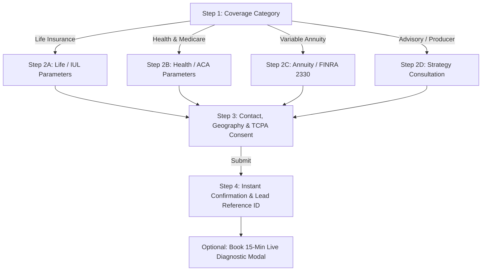

# MyIAD.com — User Intake Questionnaire & Multi-Step Lead Flow Specification

**Document Version:** 1.0.0 (Production Specification)  
**Author:** Product & Strategy Lead (AB Global Consulting)  
**Target Domain:** `https://myiad.com`  
**Integration Target:** `https://crm.myiad.net` Lead Pipeline  
**Principal Advisor & License:** Angel Burgos, Florida State 0215 Life, Health & Variable Annuities (`#G328926`)  
**Design Tokens:** Trust Navy (`#0B1F3A`), Tech Blue (`#2563EB`), Accent Teal (`#14B8A6`), Surface Clean (`#F8FAFC`), Text Charcoal (`#111827`)

---

## 1. Problem and Target User

### 1.1 The Business & Operational Problem
Inbound insurance acquisition on digital properties frequently suffers from two compounding failure modes:
1. **Low-Intent Drop-off (Friction Fatigue):** Long monolithic forms asking invasive personal or health questions upfront trigger bounce rates exceeding 70%.
2. **Unqualified Low-Quality Leads:** Single-step "quick quote" forms capture only name and email without critical underwriting parameters (e.g., target coverage, age range, tobacco status, retirement timeline, or suitability indicators), resulting in wasted advisor call time and low conversion to signed applications.
3. **Regulatory Non-Compliance:** Insurance marketing across Life, Health, and especially Variable Annuities requires strict adherence to TCPA consent protocols (1:1 consent tracking) and FINRA Rule 2330 supervisory guidelines for variable annuity suitability triage.

### 1.2 Target User Personas
- **Persona A: Wealth & Family Protection Seekers (Consumers / Families)**
  - *Profile:* Ages 28–55 in Florida & Puerto Rico looking for term life, Indexed Universal Life (IUL), or living benefit cash-value accumulation.
  - *Desired Outcome:* Understand coverage options with zero deceptive pricing; quickly submit parameters to receive an institutional illustration and a licensed advisor consultation.
- **Persona B: Medicare & Health Coverage Consumers**
  - *Profile:* Individuals turning 65 (Medicare Advantage / Supplement) or self-employed individuals needing ACA individual/family coverage.
  - *Desired Outcome:* Verify network, prescription, and premium tiers without high-pressure call center harassment.
- **Persona C: Retirement Accumulators & Annuity Clients (High Net Worth / Pre-Retirees)**
  - *Profile:* Ages 50–70 seeking guaranteed lifetime withdrawal benefits, tax deferral, and downside protection against market volatility.
  - *Desired Outcome:* Fiduciary-level consultation adhering to FINRA Rule 2330 suitability requirements.
- **Persona D: Independent Producers & Agency Principals (B2B)**
  - *Profile:* Licensed agents and agency principals exploring MyIAD ecosystem tools, bilingual quoting capabilities, or partnership opportunities.
  - *Desired Outcome:* Rapid routing to agency leadership diagnostic sessions.

---

## 2. Current Evidence and Assumptions

### 2.1 Current Verified Technical Evidence
- **Brand Tokens & UI System:** Implemented in `src/components/myiad/tokens.ts` and `src/app/globals.css`. Uses Trust Navy (`#0B1F3A`), Tech Blue (`#2563EB`), Accent Teal (`#14B8A6`), Clean White (`#F8FAFC`), and Charcoal (`#111827`).
- **Lead Pipeline Webhook Contract:** Implemented in `src/lib/integrations/crm-myiad.ts` with strict TypeScript validation (`validateMyIADLeadPayload`). Defines data fields for applicant contact, geographic territory, category, quote parameters, TCPA consent logging, and CRM webhook dispatch (`crm.myiad.net/api/webhooks/leads`).
- **Existing Acquisition Components:** 
  - `src/components/QuoteSelectorForm.tsx`: 4-step interactive quote selector with client-side state machine (`useQuoteAndLeadRouting.ts`).
  - `src/components/myiad/MyIADLeadForm.tsx`: Tabbed conversion module allowing direct quote inquiry or immediate calendar scheduling.
  - `src/components/CalendarBookingModal.tsx`: Direct Cal.com / Calendly modal integration for 15-minute diagnostic appointments.
- **API Routing:** `src/app/api/leads/quote-routing/route.ts` provides server-side payload normalization, validation, attribution capture, dual-storage in database, and CRM webhook routing.

### 2.2 Assumptions
- **Assumption 1:** Leads captured on `myiad.com` route to the CRM pipeline at `https://crm.myiad.net/api/webhooks/leads` with graceful offline fallback when the remote endpoint is in staging or network-partitioned.
- **Assumption 2:** Inbound prospects should not be asked for Social Security Numbers (SSN), detailed medical history, or banking data during intake; these are strictly deferred to post-consultation formal carrier application stages.
- **Assumption 3:** Florida area codes (e.g., 386, 407, 305, 813) and Puerto Rico area codes (787, 939) trigger automatic regional territory assignment in the CRM.

---

## 3. Proposed Solution: 4-Step Progressive Lead Intake Engine

The intake flow utilizes a **Progressive Disclosure Architecture** divided into 4 clear steps, maintaining high momentum, zero cognitive overwhelm, and compliance auditing at every step.

### 3.1 Step Breakdown & Field Taxonomy

#### Step 1: Solution Intent & Category Selection (Zero Friction)
- **Goal:** Determine primary intent with a single click.
- **Options:**
  1. `life`: Life Insurance (Term, Indexed Universal Life, Living Benefits)
  2. `health`: Health & Medicare Advisory (ACA, Medicare Advantage/Supplement)
  3. `variable_annuity`: Variable Annuity & Retirement (FINRA Rule 2330 Suitability)
  4. `strategic-portfolio`: Comprehensive Wealth Advisory / Producer Partnership
- **Interaction:** Cards with visual icons, micro-copy, and active indicator. Auto-populates defaults and advances or allows immediate "Next Step".

#### Step 2: Product & Underwriting Parameters (Dynamic Branching)
Branching dynamically adapts the form fields based on Step 1 selection:

* **Branch A: Life Insurance (`life`)**
  - **Plan Type (`productSubtype`):**
    - Indexed Universal Life (IUL - Tax-Free Cash Value & 0% Floor)
    - Term Life with Living Benefits (Chronic/Critical Illness Riders)
    - Whole Life & Final Expense Protection
  - **Target Protection / Capital (`coverageOrInvestmentAmount`):**
    - `$100,000 - $250,000` (Starter Protection)
    - `$250,000 - $500,000` (Standard Family Coverage)
    - `$500,000 - $1,000,000` (High Asset / Income Replacement)
    - `$1,000,000+` (Institutional / Estate Planning)
  - **Age Bracket (`ageRange`):** `18-29`, `30-45`, `46-59`, `60+`
  - **Tobacco / Nicotine Use (`tobaccoUse`):** `No (Preferred Rate)` / `Yes`

* **Branch B: Health & Medicare (`health`)**
  - **Coverage Type (`productSubtype`):**
    - Individual & Family ACA Marketplace Plan
    - Medicare Advantage (Part C) & Part D Prescription
    - Medicare Supplement (Medigap)
    - Small Business Group / Self-Employed Plan
  - **Household Size (`householdMembers`):** `1 (Individual)`, `2-3 Members`, `4+ Family`
  - **Current Plan Status (`currentPlanStatus`):**
    - Uninsured / Need immediate coverage
    - Exploring lower premiums / better doctor network
    - Approaching Medicare Age 65

* **Branch C: Variable Annuities & Wealth Accumulation (`variable_annuity`)**
  - **Investment Target (`coverageOrInvestmentAmount`):**
    - `$50,000 - $100,000`
    - `$100,000 - $250,000`
    - `$250,000 - $500,000`
    - `$500,000+`
  - **Time Horizon to Retirement (`targetRetirementAge`):** `<3 years`, `3-7 years`, `7-15 years`, `15+ years`
  - **Risk Tolerance (`riskTolerance`):** `Conservative Capital Preservation`, `Balanced Growth & Income`, `Growth Focused`
  - **FINRA Rule 2330 Disclosure Banner:** Visible notice indicating variable annuities involve investment risk, fluctuation in value, and supervisory suitability review by a registered principal prior to issuance.

#### Step 3: Identity, Geography & Compliant Consent
- **Contact Fields:**
  - First Name (`applicantFirstName`) [Required, trim string]
  - Last Name (`applicantLastName`) [Required, trim string]
  - Direct Phone Number (`applicantPhone`) [Required, E.164 / 10-digit US/PR validation]
  - Email Address (`applicantEmail`) [Required, RFC-compliant format]
  - ZIP Code (`zipCode`) [Required, 5-digit US/PR regex `^\d{5}(-\d{4})?$`]
- **Preference Selectors:**
  - Preferred Contact Method (`preferredContactMethod`): `Phone Call` | `SMS Text` | `Video Consultation` | `Email`
  - Preferred Time of Day (`preferredTimeOfDay`): `Morning (9am-12pm)` | `Afternoon (12pm-5pm)` | `Evening (5pm-8pm)`
- **Regulatory Consent Checkbox (`consent`):**
  - Mandatory affirmative unchecked opt-in checkbox.
  - Statutory TCPA Language: *"By checking this box and clicking 'Submit Quote Request', I provide express affirmative written consent for Angel Burgos and AB Global Consulting / MyIAD representatives to contact me at the phone number and email provided regarding insurance and financial advisory solutions. I understand consent is not required as a condition of purchase and message/data rates may apply. You may opt out at any time."*
  - Audit Trail Fields Logged: `consent: true`, `consentTimestamp: ISO-8601`, `consentVersion: "myiad_tcpa_v2.0"`.

#### Step 4: Submission State & Instant Advisor Bridge
- **Success Display:**
  - Generates verifiable **Lead Tracking ID** (e.g. `MYIAD-2026-X89K2`).
  - Summarizes submitted parameters and territory routing confirmation.
- **Conversion Accelerator (Modal / Link):**
  - Secondary CTA: *"Want instant answers? Lock in your 15-Minute Diagnostic Consultation now."*
  - Launches `CalendarBookingModal` pre-populated with prospect name and email.

---

## 4. In-Scope vs. Out-of-Scope Work

### 4.1 In-Scope (MVP Release)
1. **Interactive 4-Step Form Component (`QuoteSelectorForm.tsx` & `MyIADLeadForm.tsx`):**
   - Seamless embedding on `https://myiad.com` (`src/app/myiad/page.tsx`).
   - Dynamic step navigation with client-side field validation and clear error states.
   - Mobile-responsive layout strictly matching MyIAD brand tokens.
2. **Standardized API Ingestion Route (`/api/leads/quote-routing`):**
   - Server-side payload validation via `validateMyIADLeadPayload`.
   - Dual-persistence to local database and dispatch to `crm.myiad.net/api/webhooks/leads`.
   - Full attribution extraction (UTM source, medium, campaign, referrer).
3. **TCPA & FINRA 2330 Compliance Gateways:**
   - Enforced affirmative consent logging and variable annuity disclosure acknowledgement.
4. **Calendar Booking Bridge:**
   - Direct trigger to Cal.com / Calendly 15-minute diagnostic appointment booking.

### 4.2 Out-of-Scope (Phase 2 Enhancements)
1. **Live Carrier Quoting API Integration:** Integration with external real-time rating engines (e.g. CSG Actuarial, Compulife API) for instant dollar premiums prior to advisor review.
2. **HIPAA / Detailed Health Intake:** Detailed medical history, prescription drug databases, or electronic health records (EHR) integrations.
3. **Client Self-Service Policy Dashboard:** Client login for tracking existing policies (delegated to `crm.myiad.net` portal).
4. **Automated Document Generation:** Instant generation of ACORD or FINRA 2330 suitability binder PDFs on the public landing page.

---

## 5. Acceptance Criteria

| ID | Category | Criterion | Test Verification Method |
| :--- | :--- | :--- | :--- |
| **AC-1** | **Progression** | User must experience a frictionless 4-step progressive flow with step indicator (Coverage -> Details -> Contact -> Confirmation). | Cypress / Playwright E2E test verifying step transitions and state retention. |
| **AC-2** | **Branching** | Step 2 fields must conditionally render based on Step 1 selection (Life vs Health vs Variable Annuity). | Unit test on `useQuoteAndLeadRouting` verifying `quoteParams` updating per category. |
| **AC-3** | **Validation** | Form must block submission and visually flag invalid emails, phone numbers < 10 digits, invalid ZIPs, and missing consent. | Client-side test asserting error badges appear and submit button is halted. |
| **AC-4** | **Payload Contract** | The POST request to `/api/leads/quote-routing` must match `MyIADLeadSubmissionPayload` exactly, including UTM tracking and territory detection. | API integration test verifying JSON response `{ success: true, leadId: string }`. |
| **AC-5** | **CRM Webhook** | Submissions must dispatch to `crm.myiad.net/api/webhooks/leads` with a 10s timeout and graceful simulated fallback. | Mock server test verifying webhook receipt and fallback response on network timeout. |
| **AC-6** | **FINRA 2330** | When `variable_annuity` is selected, the FINRA Rule 2330 disclosure banner must render and the acknowledgment must be recorded. | Component visual regression test and payload schema validation. |
| **AC-7** | **TCPA Consent** | Consent checkbox must be unchecked by default. Checking it logs `consentTimestamp` and `consentVersion: "myiad_tcpa_v2.0"`. | Integration test verifying database entry contains consent metadata. |
| **AC-8** | **Scheduling Bridge** | Step 4 must display a valid confirmation ID and offer a 1-click trigger to `CalendarBookingModal` with pre-filled lead details. | UI test checking modal opens with populated prospect name and email. |

---

## 6. Dependencies and Operational Risks

### 6.1 Dependencies
- **CRM Ingestion Endpoint:** `crm.myiad.net/api/webhooks/leads` webhook listener must be reachable or operate with offline queueing.
- **Calendar Availability:** Active scheduling link on Cal.com / Calendly (`https://cal.com/angelburgos/15min`).
- **Transactional Communications:** Twilio SMS / SendGrid Email API credentials in environment configuration (`.env.local`).

### 6.2 Operational & Regulatory Risks
- **TCPA Regulatory Risk:** Inadequate consent phrasing can expose the agency to statutory penalties under FCC TCPA regulations.  
  *Mitigation:* Specific 1:1 consent language referencing AB Global Consulting and Angel Burgos, with mandatory affirmative check and UTC timestamp logging.
- **FINRA Rule 2330 Suitability Risk:** Misrepresenting variable annuities as guaranteed deposits or omitting risk factors violates FINRA standards.  
  *Mitigation:* Prominent supervisory disclosure and clear statement that submission is an informational consultation inquiry, not an execution of securities transactions.
- **Form Abandonment Risk:** Multi-step forms may see drop-off between Step 2 and Step 3.  
  *Mitigation:* Top bar provides an immediate "Skip Form & Book Meeting" bypass directly into the 15-minute diagnostic calendar.

---

## 7. Strategic Decisions Needed from Angel (CEO & Principal Advisor)

1. **Scheduling Engine Priority:** Confirm whether consumer calendar appointments should route primarily to `https://cal.com/angelburgos/15min` or an internal `crm.myiad.net/book/angel` booking endpoint once live.
2. **Dual-Persistence Configuration:** Confirm that leads captured on `myiad.com` should persist in the local PostgreSQL database (`leads` table) as well as immediately dispatching to the `crm.myiad.net` webhook.
3. **Entity & Disclaimer Verification:** Approve the formal footer disclosure text:
   *"MyIAD is operated by AB Global Consulting LLC. Insurance advisory services provided by Angel Burgos, Florida Licensed 0215 Life, Health & Variable Annuities (#G328926). Variable products are subject to investment risk and supervisory review under FINRA Rule 2330."*
