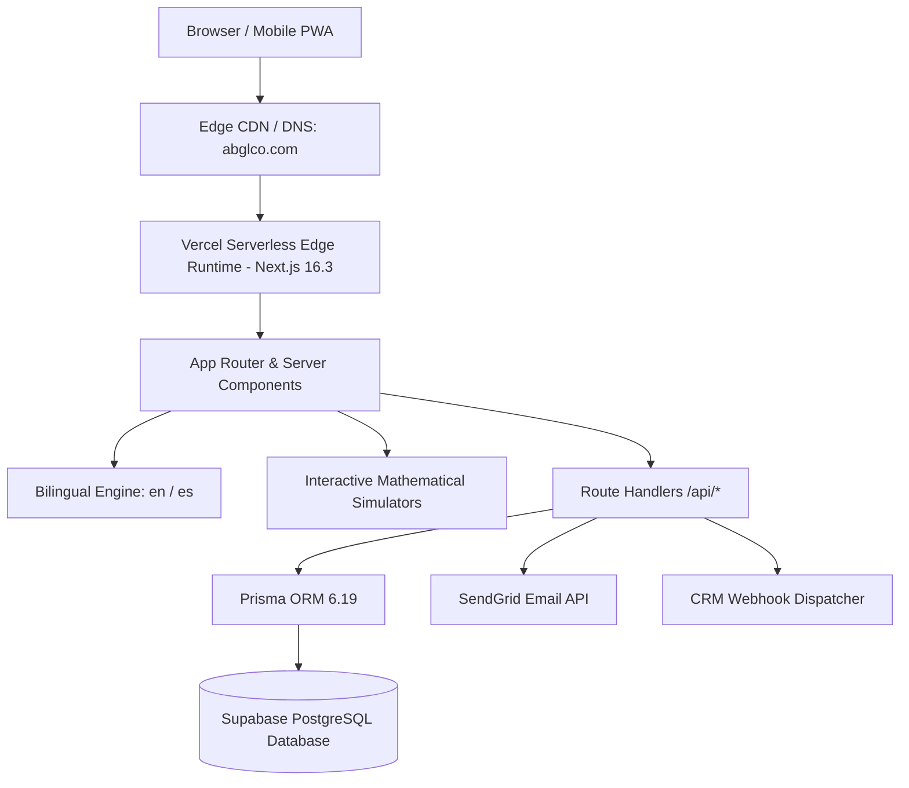
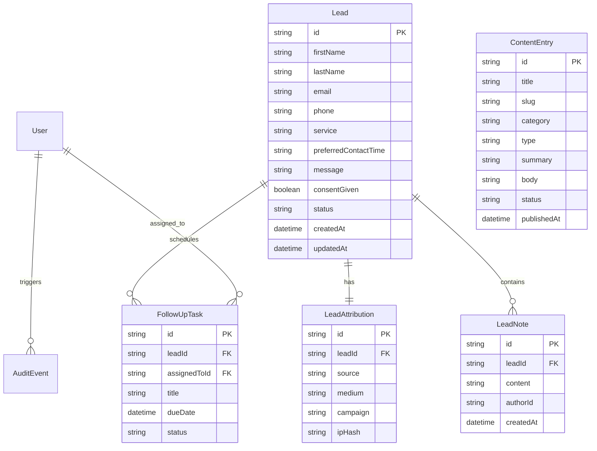

# AB Global Consulting — Product Specification & Technical Architecture

**Domain:** `https://abglco.com`  
**License:** Florida State Licensed 0215 Life, Health & Variable Annuities (`#G328926`)  
**National Producer / WFG Agent Code:** `F6D9U`  
**Primary Markets:** Central Florida (Orlando, Kissimmee, Tampa, Miami) & Puerto Rico  
**Version:** 1.0.0 (Production Baseline)

---

## 1. Executive Summary & Vision

The **AB Global Consulting Web Application** is a high-performance, bilingual digital advisory and client acquisition platform engineered for **Angel Burgos**, a Florida-licensed 0215 financial professional. 

Unlike traditional generic insurance landing pages, this application combines **engineering-grade mathematical modeling**, **interactive financial simulators**, and **frictionless omnichannel communication** (WhatsApp, SMS, Direct Call, Consultation Scheduling) to demystify complex financial instruments—specifically **Indexed Universal Life (IUL)**, **Guaranteed Lifetime Annuities**, and **Everest 24/7 Funeral Concierge Services**.

---

## 2. Technology Stack & Infrastructure

### Core Architecture Components

| Layer | Technology | Purpose / Justification |
| :--- | :--- | :--- |
| **Framework** | **Next.js 16.3 (Turbopack)** | React Server Components (RSC), App Router, dynamic metadata, and edge optimization. |
| **Runtime** | **React 19.2 + TypeScript 5.9** | Strict type safety, concurrent rendering, and fast client hydration. |
| **Styling & Design System** | **Tailwind CSS v4 + Vanilla Tokens** | Modern glassmorphism, responsive bento grids, curated institutional navy/emerald/gold palette. |
| **Interactive Visualization** | **Recharts 3.10** | High-performance SVG charting for financial simulations (0% floor, compounding curve). |
| **Database & Persistence** | **Supabase PostgreSQL 17** | Scalable relational storage hosted in `us-east-2` with automated backup and pooling. |
| **ORM & Data Modeling** | **Prisma 6.19** | Type-safe database queries, declarative schema migrations, and client generation. |
| **Security & Auth** | **Supabase Auth + Row-Level Security (RLS)** | OAuth Google Workspace login, magic links, session cookies, and database access control. |
| **Bilingual Localization** | **React Context (`LanguageContext`)** | Zero-latency instant switching between English (`en`) and Puerto Rico Spanish (`es`). |
| **Transactional Email** | **SendGrid v3 API** | Instant notifications for incoming leads and downloadable consumer guide delivery. |
| **Edge Hosting** | **Vercel Serverless Platform** | Global edge CDN, automated CI/CD from GitHub, zero-downtime atomic deployments. |

---

## 3. Comprehensive Feature Matrix

### 3.1. Public Client-Facing Portal

1. **Top Micro-Header & Trust Bar:**
   * Live license badge: `FL License #G328926 (0215 Practitioner)` & `WFG Agent F6D9U`.
   * Social profile links: LinkedIn, Facebook, WhatsApp, and Telegram.
   * Prominent interactive **Bilingual Language Switcher (`[ 🇺🇸 English | 🇵🇷 Español ]`)**.
   * One-click direct calling: `(386) 333-1482`.

2. **Institutional Hero Section:**
   * Dynamic headlines tailored to family wealth preservation and tax-free retirement strategies.
   * Key mathematical anchors: *0% Floor Protection*, *IRS Sec 7702 Tax Exemption*, *24-48 Hr Everest Payout*.
   * Dual CTAs: *Schedule Free Consultation* (smooth scroll) and *Launch IUL Wealth Simulator*.

3. **Authorized Carrier Network Ribbon:**
   * Highlights independent broker representation of top-tier carriers: **Nationwide Financial**, **Transamerica**, **Pacific Life**, **Everest Funeral Concierge / WSG**, and **World Financial Group**.

4. **Strategic 5-Pillar Solutions Bento Grid:**
   * **Life Insurance & IUL:** Living benefits, chronic/critical illness riders, 0% downside floor, tax-free policy loans.
   * **Variable & Fixed Indexed Annuities:** 401(k) / IRA rollovers, guaranteed lifetime monthly income streams, elimination of sequence of returns risk.
   * **Final Expense & Everest Concierge:** Guaranteed whole life insurance paired with 24/7 price negotiation saving families $3,500+.
   * **Health Insurance & Medicare Solutions:** ACA marketplace subsidy optimization, Medicare Supplement (Medigap Plans G/N).
   * **Long-Term Care Planning:** Nationwide CareMatters Together cash-indemnity benefits (monthly cash without receipts).

5. **3 Interactive Mathematical Mini-Apps:**
   * **IUL Wealth & 0% Floor Engine (`/tools/iul-calculator`):**
     * Dynamic sliders for Current Age (18–60), Retirement Age (50–75), Monthly Contribution ($100–$3,000), and Index Return (4%–10%).
     * Visual toggle for *"Simulate -25% Market Crash"* showing how the 0% floor protects capital while taxable index funds suffer losses.
     * Export options: **Print / Save as PDF**, **Share Scenario via WhatsApp**, and **Copy Unique URL**.
   * **Guaranteed Annuity Paycheck Tool (`/tools/annuity-estimator`):**
     * Models lump-sum 401(k)/IRA rollovers into contractually guaranteed lifetime monthly paychecks.
   * **Everest Funeral Concierge Savings Calculator (`/tools/funeral-cost-savings`):**
     * Compares retail mortuary costs across Central Florida / PR against Everest negotiated rates.

6. **Complimentary Consumer Guide Downloads (Lead Magnets):**
   * *Florida 2026 IUL & Retirement Blueprint* (IRS 7702 mechanics).
   * *Everest Funeral Pre-Planning & Savings Checklist*.
   * Auto-captures prospect name, email, and phone, and stores them in Supabase.

7. **Verified Client Case Studies & Testimonials:**
   * Real customer outcomes covering life insurance, retirement rollovers, and emergency funeral claim resolution in Orlando, Kissimmee, Tampa, and San Juan, PR.

8. **Sticky Mobile Action Bar (`FloatingMobileBar`):**
   * Bottom bar on mobile devices offering one-tap **Call**, **WhatsApp**, **SMS Text**, and **Quote Request**.

---

### 3.2. Staff & Advisor Admin Console (`/admin`)

* **Lead Management Dashboard (`/admin/leads`):**
  * Filter leads by status (`NEW`, `CONTACTED`, `QUALIFIED`, `CLOSED`).
  * Click into individual leads to view submission details, UTM source attribution, and consent records.
  * Add internal timestamped private notes and assign follow-up tasks with due dates.
* **Content Management System (`/admin/content`):**
  * Create, edit, and publish dynamic articles and educational guides for the `/resources` portal.
* **Real-Time Analytics (`/admin/analytics`):**
  * Visualizes consultation form completion rates, popular products, and traffic referral sources.

---

### 3.3. Client Portal (`/portal`)

* Client account dashboard for authenticated policyholders to view their consultation history, manage profile information, and request upcoming policy reviews.

---

## 4. Database Schema & Data Models

Managed via **Prisma ORM** connecting to **Supabase PostgreSQL**:

---

## 5. SEO, Social & Marketing Infrastructure

1. **Rich Snippets & JSON-LD (`src/lib/seo/schema.ts`):**
   * `InsuranceAgency` & `FinancialService` structured schemas.
   * `LocalBusiness` geo-location markup for Orlando, FL (`28.4312° N, 81.3965° W`).
   * `WebApplication` schema for interactive calculators.
2. **Automated Search Crawler Directives:**
   * Dynamic XML sitemap generated at `/sitemap.xml` listing all pages and product paths.
   * `robots.txt` generated at `/robots.txt` disallowing private administrative and API routes.
3. **PWA Mobile Web App Manifest (`src/app/manifest.ts`):**
   * Configured for iOS and Android mobile installation as a standalone progressive web app.
4. **Open Graph & Twitter Cards:**
   * High-resolution branded social preview cards referencing `https://abglco.com`.

---

## 6. Environment Variables Reference

| Variable Name | Required | Example / Description |
| :--- | :--- | :--- |
| `NEXT_PUBLIC_SITE_URL` | **Yes** | `https://abglco.com` |
| `NEXT_PUBLIC_SUPABASE_URL` | **Yes** | `https://pgnnrmeisikhueadgitn.supabase.co` |
| `NEXT_PUBLIC_SUPABASE_ANON_KEY`| **Yes** | Public Supabase anonymous JWT key |
| `SUPABASE_SERVICE_ROLE_KEY` | **Yes** | Secret Supabase key for server-side Prisma migrations |
| `DATABASE_URL` | **Yes** | PostgreSQL connection URI for Supabase pooling |
| `SENDGRID_API_KEY` | Optional | SendGrid API key for automated lead alert emails |
| `CRM_WEBHOOK_URL` | Optional | Webhook endpoint (Zapier / Make / HubSpot / WFG CRM) |
| `EMAIL_FROM` | Optional | Sender address (e.g. `notifications@abglco.com`) |

---

## 7. Future Development Roadmap

### Phase 2: Client Vault & Quote Automation
- [ ] **Policy Document Vault:** Secure upload portal for client policy summaries and annual statements.
- [ ] **Automated SMS Sequences:** Integration with Twilio for instant 2-minute SMS acknowledgment to new lead submissions.
- [ ] **Carrier Quote API Integration:** Live real-time rate comparison APIs for term life insurance quotes.

### Phase 3: AI Voice & Financial Assistant
- [ ] **Deepgram Bilingual Voice Agent:** AI voice assistant capable of answering consumer questions about IUL and Everest funeral planning in fluent Spanish and English.
- [ ] **CRM Bi-Directional Sync:** Deep sync between Supabase leads and external agency management systems.
