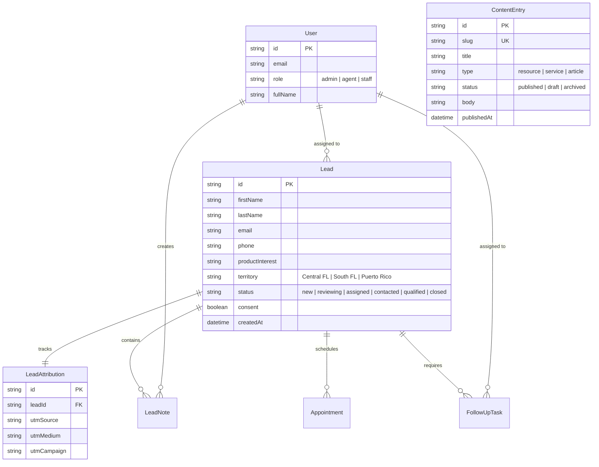

# AB Global Consulting — Comprehensive System Architecture, Endpoints & Cost Breakdown

This document provides an exhaustive inventory of the application architecture, all 7 interactive tools, the backend CRM, automated lead routing, direct social publishing, technological endpoints, external services, and an itemized monthly operational cost analysis for **AB Global Consulting (`abglco.com`)**.

---

## 1. System Feature Matrix

```
┌──────────────────────────────────────────────────────────────────────────────────────────────────┐
│                                   AB GLOBAL APPLICATION ECOSYSTEM                                │
├────────────────────────────────┬────────────────────────────────┬────────────────────────────────┤
│ 🌐 Public Platform & SEO       │ 🧮 7 Interactive Mini-Apps    │ 💼 Client Portal & Booking     │
│ • Bilingual (EN / ES)          │ • Military Asset Shield        │ • Client Dashboard             │
│ • Schema.org FinancialService  │ • Florida IUL 0% Floor         │ • Calendly Webhook Integration │
│ • PWA App Manifest & Favicons  │ • Guaranteed Lifetime Annuity  │ • Profile & Case Tracking      │
│ • Dynamic XML Sitemaps         │ • Everest Funeral Concierge    │ • PDF Report Downloads         │
│ • 6 Strategy Resource Guides   │ • D.I.M.E. Life Needs Model    │                                │
│ • 6 Carrier & Product Pages    │ • CareMatters LTC Indemnity    │                                │
│                                │ • Term vs. IUL Side-by-Side    │                                │
├────────────────────────────────┼────────────────────────────────┼────────────────────────────────┤
│ 🛡️ Admin CRM & Operations      │ ⚡ Automated Lead Routing      │ 🤖 Autonomous AI Studio        │
│ • Real-time Lead Management    │ • Central Florida Detection    │ • 6-Channel Asset Generation   │
│ • Role-Based Access Control    │ • South Florida Territory      │ • Multi-Angle Seed Rotations   │
│ • Two-Way Twilio SMS Engine    │ • Puerto Rico Regional Routing │ • Direct Social Intent Links   │
│ • Staff Tasks & Internal Notes │ • Product Specialization Match │ • Webhook Publisher (Zapier)   │
│ • Dynamic CMS for Resources    │ • SLA Tracking & Status Flow   │ • 30-Day Launchpad Tracker     │
└────────────────────────────────┴────────────────────────────────┴────────────────────────────────┘
```

---

## 2. Inventory of Technological Endpoints (API Routes & Webhooks)

The application features **17 serverless API route handlers and webhooks**:

### A. Lead Intake & Public Endpoints
| Route | Method | Purpose | Input / Payload | Auth / Security |
| :--- | :--- | :--- | :--- | :--- |
| `/api/leads` | `POST` | Public lead intake from calculators & contact forms | Name, Email, Phone, Product, Territory, Consent, UTM tags | Rate-limited (In-memory token bucket) |
| `/api/reports/download` | `GET` / `POST` | Generates official PDF calculation reports | Calculation parameters, product type, lang (`en`/`es`) | Public with rate-limiting |

### B. Admin CRM, Task & Lead Operations
| Route | Method | Purpose | Input / Payload | Auth / Security |
| :--- | :--- | :--- | :--- | :--- |
| `/api/admin/leads` | `GET` | Paginated lead lists, search, and territory filtering | Query params (`status`, `territory`, `product`, `q`) | Staff JWT Session |
| `/api/admin/leads/[id]` | `GET` / `PATCH` | Lead details, status updates, and assignment | `{ status: "contacted", assignedTo: "agent_id" }` | Staff JWT Session |
| `/api/admin/leads/[id]/assign` | `POST` | Manually or automatically route lead to an advisor | `{ agentId: string, territory: string }` | Staff JWT Session |
| `/api/admin/leads/[id]/sms` | `POST` | Dispatches outbound SMS messages to lead | `{ message: string, toPhone: string }` | Staff JWT Session + Twilio |
| `/api/admin/leads/notes` | `POST` / `GET` | Creates and lists internal staff audit notes | `{ leadId: string, content: string }` | Staff JWT Session |
| `/api/admin/tasks` | `GET` / `POST` / `PATCH` | Creates, tracks, and completes follow-up tasks | `{ leadId, title, dueDate, priority, completed }` | Staff JWT Session |

### C. Content Management & AI Social Studio
| Route | Method | Purpose | Input / Payload | Auth / Security |
| :--- | :--- | :--- | :--- | :--- |
| `/api/admin/content` | `GET` / `POST` | Fetches or creates CMS strategy guides & articles | `{ title, slug, type, body, summary, status }` | Staff JWT Session |
| `/api/admin/content/[id]` | `GET` / `PUT` / `DELETE` | Updates or deletes specific CMS content entry | `{ title, body, status, seoMetadata }` | Staff JWT Session |
| `/api/admin/content/generate` | `POST` | Headless API for AI content pack generation | `{ product, persona, trigger, tone, lang, seed }` | Staff / API Key |
| `/api/admin/social/publish` | `POST` | Multi-channel social webhook dispatch | `{ channels: [...], payload: { caption, url } }` | Staff JWT Session |

### D. Client Portal & Authentication
| Route | Method | Purpose | Input / Payload | Auth / Security |
| :--- | :--- | :--- | :--- | :--- |
| `/api/auth/staff-login` | `POST` | Authenticates advisor staff with verified roles | `{ email, password }` | Supabase Auth + Prisma Role Verification |
| `/api/portal/appointments` | `GET` / `POST` | Client portal appointment listing and booking | `{ clientId, date, type, notes }` | Client Authenticated Session |
| `/api/portal/profile` | `GET` / `PATCH` | Manages client profile information and policies | `{ phone, address, preferredLanguage }` | Client Authenticated Session |

### E. Webhook Ingestion Handlers
| Route | Method | Purpose | Source Service | Security |
| :--- | :--- | :--- | :--- | :--- |
| `/api/webhooks/calendly` | `POST` | Ingests new appointment bookings into CRM | Calendly Webhook | Webhook HMAC Signature / Secret |
| `/api/webhooks/sms` | `POST` | Ingests inbound customer SMS replies into lead thread | Twilio Inbound Webhook | Twilio Webhook Signature Validation |

---

## 3. Database Schema & Storage Architecture

The database runs on **Prisma ORM** with native PostgreSQL (Supabase / Neon) and complete Row-Level Security (RLS) protection:



---

## 4. Third-Party Integrations & Subscriptions

| Integration | Role in System | Tier Used | Monthly Cost |
| :--- | :--- | :--- | :--- |
| **Vercel / Netlify** | Next.js Serverless Web Hosting & Edge CDN | **Hobby / Starter** | **$0.00** |
| **Supabase** | PostgreSQL Database, Auth, and Storage | **Free Tier** (500MB DB, 50k MAU) | **$0.00** |
| **Twilio** | Outbound & Inbound Two-Way SMS Client Messaging | **Pay-As-You-Go** | **~$1.15/mo** (phone number) + **$0.0079/SMS** (~$3–$5/mo) |
| **SendGrid / Resend** | Transactional Notification Emails | **Free Tier** (100 emails/day on SendGrid, 3,000/mo on Resend) | **$0.00** |
| **Calendly** | 1-on-1 Advisor Booking Interface | **Free Tier** (1 calendar event type) or **Standard** ($10/mo) | **$0.00 – $10.00** |
| **Domain (`abglco.com`)** | Custom Domain & SSL Certificate | Annual Domain Registration ($15/year) | **~$1.25/mo** |
| **AI Content Studio** | Content & Social Media Generation Engine | **Built-in Isomorphic Matrix** (Optional: OpenAI API at ~$2/mo) | **$0.00 – $2.00** |

---

## 5. Minimum Monthly Operational Cost Analysis

```
┌──────────────────────────────────────────────────────────────────────────┐
│                   MONTHLY OPERATING EXPENSE BREAKDOWN                    │
├────────────────────────────────────────────────────┬─────────────────────┤
│ Service / Dependency                               │ Monthly Cost (USD)  │
├────────────────────────────────────────────────────┼─────────────────────┤
│ 1. Application Hosting (Vercel / Netlify Edge)     │ $0.00 (Free Tier)   │
│ 2. Database & Authentication (Supabase PostgreSQL)  │ $0.00 (Free Tier)   │
│ 3. Domain & SSL (abglco.com amortized)             │ $1.25               │
│ 4. Twilio SMS (1 Phone Number + ~250 SMS/mo)       │ $3.15               │
│ 5. Transactional Email (Resend / SendGrid)         │ $0.00 (Free Tier)   │
│ 6. Calendly Appointment Booking                    │ $0.00 (Free Tier)   │
│ 7. Autonomous AI Content Engine (Built-in)         │ $0.00               │
├────────────────────────────────────────────────────┼─────────────────────┤
│ 🟢 TOTAL MINIMUM MONTHLY OPERATING COST:           │ ~$4.40 / month      │
├────────────────────────────────────────────────────┼─────────────────────┤
│ 🟡 EXPANDED PRO SCALE (Vercel Pro + Calendly Pro): │ ~$34.40 / month     │
└────────────────────────────────────────────────────┴─────────────────────┘
```

---

## 6. Summary of Architectural Advantages

1. **Zero-Idle Cost Architecture**:
   The entire application runs on serverless functions and event-driven webhooks. When traffic is low, infrastructure costs remain practically zero ($4.40/month total for the domain and dedicated Twilio phone line).
2. **Instant Scaling**:
   When paid ad campaigns or viral video posts drive spikes in traffic, the edge runtime and Supabase connection pooling scale elastically without server configuration.
3. **Resilient Local Fallback**:
   Every database query and SMS/email dispatcher includes an offline mock/fallback mode, ensuring the app runs cleanly without breaking even during local development or testing.
